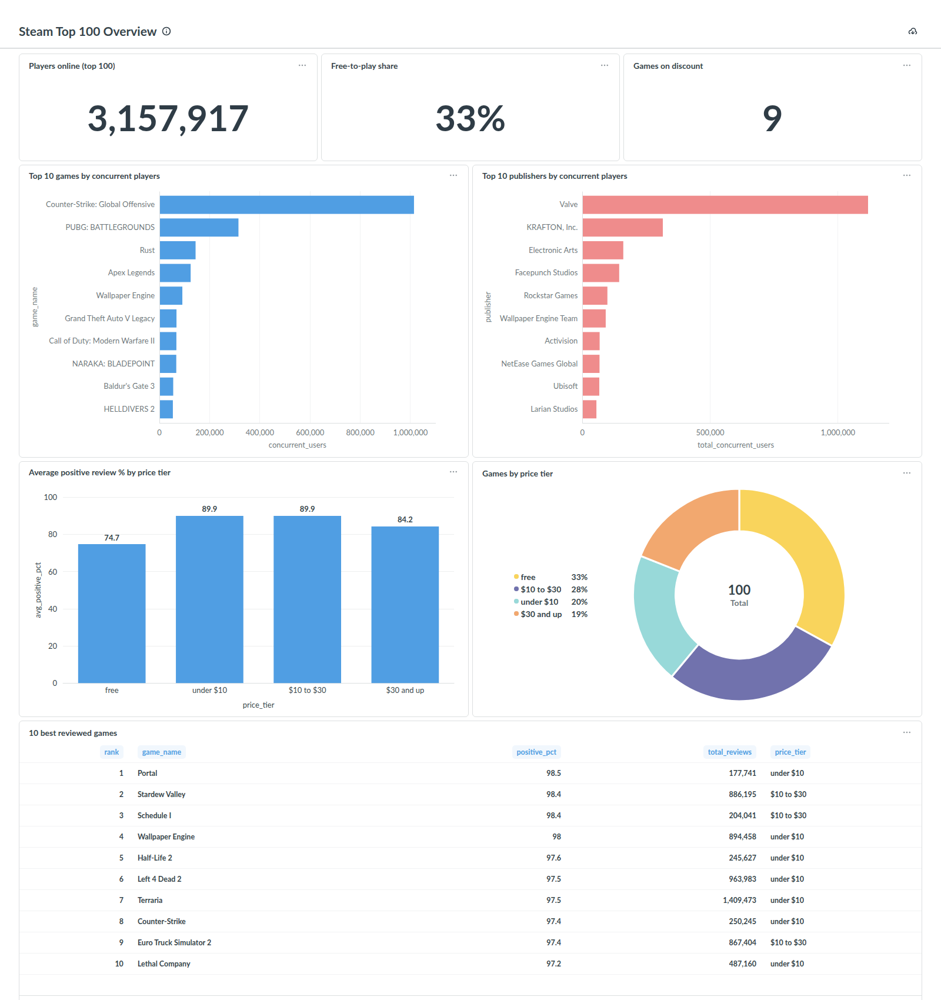
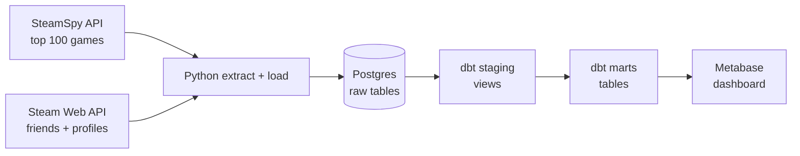
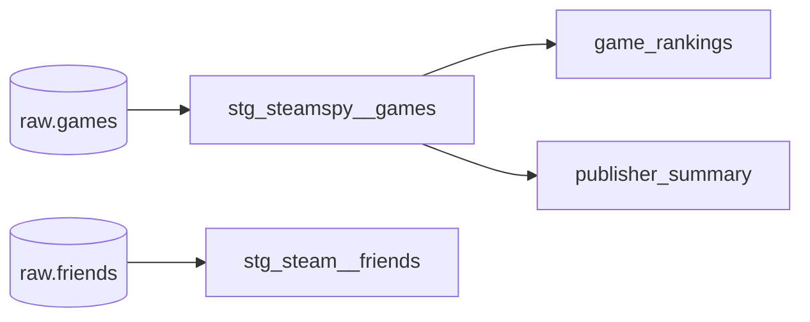

# Steam Analytics

[](https://github.com/dang2b/steam-analytics/actions/workflows/ci.yml)

An end-to-end batch data pipeline that pulls Steam game data from two public APIs, loads it into Postgres, models it with dbt and serves it in a Metabase dashboard. The whole stack runs locally with Docker, and the dashboard itself is defined as code.



## Architecture



| Layer | Tool | What it does |
|---|---|---|
| Extract | Python, `requests` | Calls the APIs with retries, exponential backoff and timeouts |
| Load | `psycopg2` | Idempotent upserts into raw Postgres tables |
| Transform | dbt (Postgres adapter) | Cleans raw data in staging, builds analytics tables in marts |
| Serve | Metabase | Dashboard built through the Metabase API by `setup_metabase.py` |
| Quality | pytest, dbt tests, ruff, GitHub Actions | Unit tests, data tests and lint on every PR |

Everything runs in Docker Compose: Postgres 15 and Metabase.

## Quickstart

You need Docker, Python 3.12 and a [Steam Web API key](https://steamcommunity.com/dev/apikey).

```bash
git clone https://github.com/dang2b/steam-analytics.git
cd steam-analytics

cp .env.example .env            # then fill in the blank values
python -m venv .venv && source .venv/bin/activate
pip install -r requirements.txt

docker compose up -d            # Postgres (creates the raw tables) + Metabase
python main.py                  # extract and load

set -a; source .env; set +a     # dbt reads credentials from the environment
(cd steam_analytics && dbt build)   # build models and run data tests

python setup_metabase.py        # build the dashboard
```

Then open http://localhost:3000 and log in with the `MB_ADMIN_*` credentials from `.env`. The dashboard is in the **Steam Analytics** collection.

## Data model



| Layer | Schema | Materialization | Purpose |
|---|---|---|---|
| Raw | `public` | tables | API data as it arrived, one row per game or friend |
| Staging | `public_staging` | views | Renames, type casts, parsing (owners buckets into numbers, cents into dollars) |
| Marts | `public_marts` | tables | Business-facing tables the dashboard reads: rankings, price tiers, publisher totals |

- **`game_rankings`**: one row per game, with concurrent-player and review-score ranks, price tier, discount flag and an owners estimate.
- **`publisher_summary`**: one row per publisher, with game count, total concurrent players and a review ratio weighted by review volume.

Run `dbt docs generate && dbt docs serve` inside `steam_analytics/` to browse column descriptions and the full lineage graph.

## Data quality

- **dbt tests** on every model: primary keys are `unique` and `not_null`, labels use `accepted_values`, and a custom test checks that every parsed owners range has its minimum below its maximum.
- **Source freshness**: `dbt source freshness` warns after 1 day and errors after 7 without a new load.
- **Unit tests** (pytest) for API parsing, retry configuration and connection handling, using recorded API fixtures.
- **CI** (GitHub Actions) on every pull request: ruff lint, the unit tests, then a full `dbt build` against a fresh Postgres service loaded with the fixtures. CI never calls the live APIs, so it needs no secrets and can't fail because an external API is down.

## Design decisions

- **Raw data stays raw.** SteamSpy reports owners as a text range (`"20,000,000 .. 50,000,000"`). Ingestion stores it untouched, and dbt staging parses it into `owners_min` and `owners_max`. If the parsing is ever wrong, it's fixed in SQL and rebuilt, without re-fetching anything.
- **Top 100, not the full catalogue.** SteamSpy's `all` endpoint is paginated and rate-limited to one page a minute. The top 100 of the last two weeks keeps runs fast while the rest of the stack was built. Full-catalogue ingestion is a planned extension.
- **Missing data is null, not zero.** SteamSpy currently returns `0` for every playtime field, even for games with a million concurrent players. Staging turns those zeros into `NULL`, and the marts leave out playtime metrics rather than rank games on fake data.
- **Upserts never delete.** Loads use `INSERT ... ON CONFLICT DO UPDATE`, so re-running is safe. The downside is that friends removed since the last run stay in the table. Every upsert refreshes `loaded_at`, and staging flags rows missing from the latest load with `is_current_friend`.
- **Publishers are grouped as-is.** SteamSpy puts co-publishers in one comma-separated string, but names like `CAPCOM Co., Ltd.` contain commas too. Splitting on commas would break those names, so `publisher_summary` groups by the full string.
- **Dashboards as code.** Metabase normally keeps dashboards only in its internal database. `setup_metabase.py` rebuilds the connection, cards and dashboard through the API, so they're version-controlled and reproducible. Metabase only sees the `public_marts` schema, so every chart is built on tested, modeled data.
- **Explicit connection handling.** psycopg2's `with conn:` commits or rolls back but doesn't close the connection. `load.connect()` closes it explicitly, so a long-running scheduler wouldn't leak connections.

## Limitations and next steps

- **No history yet.** Each run overwrites the previous one, so there are no trends over time. Next: schedule daily runs and add dbt snapshots.
- **SteamSpy numbers are estimates.** Owners are ranges, not counts, and playtime isn't available.
- **Friends data isn't used in the dashboard yet.** It's ingested and staged, ready for a future mart.
- **Local-only setup.** Metabase stores its settings in an embedded H2 database, which is fine locally but should be Postgres in production. Orchestration (Airflow) and a cloud warehouse are out of scope for v1.

## Project structure

```
.
├── main.py                  # pipeline entry point: extract → load, with logging
├── extract_steamspy.py      # SteamSpy top 100 fetch + parse
├── extract_friends.py       # Steam Web API friends + profiles fetch + parse
├── http_client.py           # shared requests session: retries, backoff, timeout
├── load.py                  # Postgres upserts
├── config.py                # settings from .env
├── schema.sql               # raw tables, applied automatically on first start
├── setup_metabase.py        # dashboard as code
├── steam_analytics/         # dbt project: sources, staging, marts, tests
├── tests/                   # pytest unit tests + API fixtures
├── docker-compose.yml       # Postgres + Metabase
└── .github/workflows/ci.yml
```

## References

- [SteamSpy API](https://steamspy.com/api.php)
- [Steam Web API reference (unofficial, most complete)](https://steamapi.xpaw.me)
- [dbt docs](https://docs.getdbt.com) and [dbt Postgres setup](https://docs.getdbt.com/docs/core/connect-data-platform/postgres-setup)
- [psycopg2 docs](https://www.psycopg.org/docs/)
- [Metabase API docs](https://www.metabase.com/docs/latest/api)
