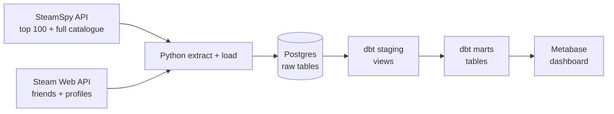
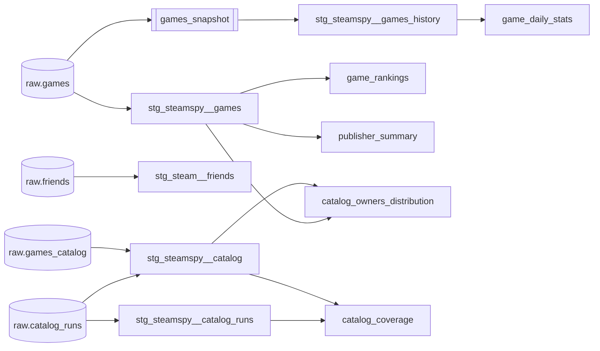

# Steam Analytics

[](https://github.com/dang2b/steam-analytics/actions/workflows/ci.yml)

An end-to-end batch data pipeline that pulls Steam game data from two public APIs, loads it into Postgres, models it with dbt and serves it in a Metabase dashboard. A daily job tracks the top 100 games, and a weekly, resumable job loads the full catalogue of about 82,000 games through a rate-limited, paginated endpoint. The whole stack runs locally with Docker, and the dashboard itself is defined as code.


## Architecture



| Layer | Tool | What it does |
|---|---|---|
| Extract | Python, `requests` | Calls the APIs with retries, exponential backoff and timeouts; throttles the catalogue endpoint to its one-page-a-minute limit |
| Load | `psycopg2` | Idempotent upserts into raw Postgres tables; the catalogue load checkpoints every page so a failed run resumes |
| Transform | dbt (Postgres adapter) | Cleans raw data in staging, builds analytics tables in marts |
| Serve | Metabase | Dashboard built through the Metabase API by `setup_metabase.py` |
| Quality | pytest, dbt tests, ruff, GitHub Actions | Unit tests, data tests and lint on every PR |

Everything runs in Docker Compose: Postgres 15 and Metabase.

## Quickstart

You need Docker, Python 3.12 and a [Steam Web API key](https://steamcommunity.com/dev/apikey).

```bash
git clone https://github.com/dang2b/steam-analytics.git
cd steam-analytics

cp .env.example .env            # then fill in the blank values
python -m venv .venv && source .venv/bin/activate
pip install -r requirements.txt

docker compose up -d            # Postgres (creates the raw tables) + Metabase
python main.py                  # extract and load the top 100 and friends
python catalog.py               # optional: full catalogue, about 1.5 hours

set -a; source .env; set +a     # dbt reads credentials from the environment
(cd steam_analytics && dbt build)   # build models and run data tests

python setup_metabase.py        # build the dashboard
```

Then open http://localhost:3000 and log in with the `MB_ADMIN_*` credentials from `.env`. The dashboard is in the **Steam Analytics** collection. The two catalogue cards stay empty until a full `catalog.py` run has finished. Postgres and Metabase only listen on localhost, so other machines on your network can't reach them.

### Development

```bash
pip install -r requirements-dev.txt   # adds pytest and ruff
pytest                                 # unit tests, no database or API calls
ruff check .                           # lint, same rules as CI
```

### Schedule (Linux)

```bash
scripts/install_schedule.sh
```

This installs two systemd user timers:

| Timer | When | Runs | What it does |
|---|---|---|---|
| `steam-pipeline` | daily, 09:00 | [`run_pipeline.sh`](scripts/run_pipeline.sh) | top 100 and friends load, then `dbt build` |
| `steam-catalog` | Sundays, 10:00 | [`run_catalog.sh`](scripts/run_catalog.sh) | full catalogue load, about 1.5 hours |

Both start Postgres if it's down. If the machine was off at the scheduled time, the run happens at the next boot. The catalogue job blocks automatic sleep while it runs, retries twice, 15 minutes apart, and each retry resumes from the next page. If a job fails for good, you get a desktop notification (via `notify-send`). Useful commands:

```bash
systemctl --user list-timers 'steam-*'               # next scheduled runs
journalctl --user -u steam-catalog.service           # logs from past runs
systemctl --user start steam-catalog.service         # run now (add --no-block for the catalogue)
systemctl --user disable --now steam-pipeline.timer steam-catalog.timer  # uninstall
```

## Data model



| Layer | Schema | Materialization | Purpose |
|---|---|---|---|
| Raw | `public` | tables | API data as it arrived, one row per game or friend, plus `catalog_runs` tracking each catalogue load |
| Snapshots | `public_snapshots` | dbt snapshot | Every version of every raw game row, one per daily load |
| Staging | `public_staging` | views | Renames, type casts, parsing (owners buckets into numbers, cents into dollars), shared by both SteamSpy tables through one macro |
| Marts | `public_marts` | tables | Business-facing tables the dashboard reads: rankings, price tiers, publisher totals |

- **`game_rankings`**: one row per game, with concurrent-player and review-score ranks, price tier, discount flag and an owners estimate.
- **`publisher_summary`**: one row per publisher, with game count, total concurrent players and a review ratio weighted by review volume.
- **`game_daily_stats`**: one row per game per day it was in the top 100, for trend charts.
- **`catalog_owners_distribution`**: one row per owners range across the full catalogue, with each range's share of games and of estimated owners, and how much of it the top 100 holds.
- **`catalog_coverage`**: one row for the latest finished catalogue run: list size, distinct games, duplicates, estimated missed games and coverage.

Run `dbt docs generate && dbt docs serve` inside `steam_analytics/` to browse column descriptions and the full lineage graph.

## Data quality

- **dbt tests** on every model: primary keys are `unique` and `not_null`, labels use `accepted_values`, and custom tests check that parsed owners ranges are valid, that `game_rankings` never exceeds 100 games, that `game_daily_stats` has one row per game per day, that the latest catalogue run loaded at least 10,000 games (so pagination didn't stop early) and that the catalogue shares add up to 1. A warning-level test flags a catalogue run that saw less than 90% of SteamSpy's list.
- **Source freshness**: `dbt source freshness` warns after 1 day and errors after 7 without a new daily load, and after 8 and 15 days for the weekly catalogue.
- **Unit tests** (pytest) for API parsing, retry configuration, key redaction, connection handling, catalogue throttling, pagination and resume, using recorded API fixtures and a fake clock, so no test waits a real minute.
- **CI** (GitHub Actions) on every pull request: ruff lint, the unit tests, then a full `dbt build` against a fresh Postgres service loaded with the fixtures. CI never calls the live APIs, so it needs no secrets and can't fail because an external API is down.

## Design decisions

- **Raw data stays raw.** SteamSpy reports owners as a text range (`"20,000,000 .. 50,000,000"`). Ingestion stores it untouched, and dbt staging parses it into `owners_min` and `owners_max`. If the parsing is ever wrong, it's fixed in SQL and rebuilt, without re-fetching anything.
- **Top 100 daily, full catalogue weekly.** SteamSpy's `all` endpoint returns the catalogue 1,000 games a page, but allows one request a minute, so a full load takes about 1.5 hours. It runs weekly as its own job, into its own table, so the daily top 100 load stays fast and its staging logic is untouched.
- **Throttle, don't just retry.** The catalogue client waits out the rest of each minute before the next request instead of waiting for a `429`. The shared session's quick retries (0, 2, 4 seconds) would break the limit themselves, so catalogue requests don't retry in place: a failed page fails the run, and the run resumes.
- **Resumable catalogue loads.** Each page commits in its own transaction together with its checkpoint in `catalog_runs`, so a crash can't leave a page saved but unrecorded, or recorded but unsaved. Rerunning continues from the next page, and systemd retries a failed weekly run twice. A resumed run waits a full minute first, because the request that crashed still counted towards the limit.
- **Stop at the last page, not at an error.** A page past the end returns HTTP 500, which looks the same as a real server error. Treating it as the end could silently cut the catalogue short, so the load stops at the first page with fewer than 1,000 games, and a dbt test fails if a finished run loaded implausibly few.
- **A run boundary instead of `max(loaded_at)`.** Top 100 staging finds current rows by the latest `loaded_at`, which works because one load is one transaction. Catalogue pages each get their own timestamp, so rows written since the latest finished run started are current. Nothing is current until a run finishes, so the dashboard never shows a half-loaded catalogue.
- **Missing data is null, not zero.** SteamSpy currently returns `0` for every playtime field, even for games with a million concurrent players. Staging turns those zeros into `NULL`, and the marts leave out playtime metrics rather than rank games on fake data.
- **Upserts never delete.** Loads use `INSERT ... ON CONFLICT DO UPDATE`, so re-running is safe. The downside is that games that dropped out of the top 100, and friends removed since the last run, stay in the raw tables. Every upsert refreshes `loaded_at`, so staging flags rows missing from the latest load (`is_in_latest_top100`, `is_current_friend`), and the marts only use current rows. A dbt test fails if `game_rankings` ever holds more than 100 games.
- **History from a snapshot of the raw source.** The APIs only return today's numbers, so history has to be captured as it happens. A dbt snapshot of `raw.games` keeps every version of each game. It snapshots the raw table rather than a model, so the history survives changes to the staging logic, and unlike an incremental model, `dbt build --full-refresh` can't wipe it.
- **Publishers are grouped as-is.** SteamSpy puts co-publishers in one comma-separated string, but names like `CAPCOM Co., Ltd.` contain commas too. Splitting on commas would break those names, so `publisher_summary` groups by the full string.
- **Dashboards as code.** Metabase normally keeps dashboards only in its internal database. `setup_metabase.py` rebuilds the connection, cards and dashboard through the API, so they're version-controlled and reproducible. Metabase only sees the `public_marts` schema, so every chart is built on tested, modeled data.
- **Explicit connection handling.** psycopg2's `with conn:` commits or rolls back but doesn't close the connection. `load.connect()` closes it explicitly, so a long-running scheduler wouldn't leak connections.

## Limitations and next steps

- **History starts on the first snapshot run.** The APIs don't serve past data, so trends only cover days the pipeline actually ran. Days the machine was off completely are gaps.
- **SteamSpy numbers are estimates.** Owners are ranges, not counts, and playtime isn't available. Owner totals use range midpoints, which is rough for the widest ranges.
- **The catalogue misses a few percent of games, and not at random.** SteamSpy orders the list by an owners estimate that shifts during the day, so during a load of an hour or more, games move between pages. A game moving to a later page is seen twice (harmless, it's an upsert); one moving to an earlier page is never seen. Repeating a request a minute apart returns the same page, so it's drift over time, not an unstable sort. The first load ran 3.8 hours because of interruptions and saw 82,518 of the list's 86,544 entries (95.4% coverage). All of the 4,026 losses came from the first 43 pages, where active games are; the long tail of small games didn't move. The missed games are mostly the ones gaining owners, so the catalogue slightly under-represents rising games. `catalog_coverage` tracks this for every run. There's no catalogue history yet, only the latest load.
- **Friends data isn't used in the dashboard yet.** It's ingested and staged, ready for a future mart.
- **Local-only setup.** Metabase stores its settings in an embedded H2 database, which is fine locally but should be Postgres in production. Orchestration (Airflow) and a cloud warehouse are out of scope for v1.

## Project structure

```
.
├── main.py                  # daily entry point: top 100 + friends, extract → load
├── catalog.py               # weekly entry point: full catalogue, checkpointed per page
├── extract_steamspy.py      # SteamSpy top 100 + throttled catalogue fetch, parse
├── extract_friends.py       # Steam Web API friends + profiles fetch + parse
├── http_client.py           # shared requests session: retries, backoff, timeout
├── load.py                  # Postgres upserts and catalogue checkpoints
├── config.py                # settings from .env
├── schema.sql               # raw tables, applied automatically on first start
├── setup_metabase.py        # dashboard as code
├── scripts/                 # daily and weekly jobs + systemd timer installer
├── steam_analytics/         # dbt project: sources, snapshots, macros, staging, marts, tests
├── tests/                   # pytest unit tests + API fixtures
├── docker-compose.yml       # Postgres + Metabase
└── .github/workflows/ci.yml
```

## References

- [SteamSpy API](https://steamspy.com/api.php)
- [Steam Web API reference (unofficial, most complete)](https://steamapi.xpaw.me)
- [dbt docs](https://docs.getdbt.com) and [dbt Postgres setup](https://docs.getdbt.com/docs/core/connect-data-platform/postgres-setup)
- [psycopg2 docs](https://www.psycopg.org/docs/)
- [Metabase API docs](https://www.metabase.com/docs/latest/api)
